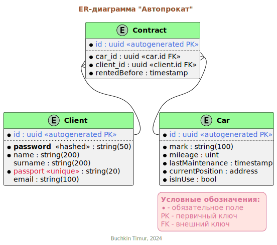

# Лаба 1
- Задания в pdf файле
- У меня варианты 3(Автопрокат) и 14(Строительная компания)

## Вариант 3 -- Автопрокат
### Выделение сущностей
- Машина, которую взяли на прокат
    - id
    - Марка
    - Пробег
    - Время последнего ТО
    - Текущее расположение(адрес)
    - Арендована/Не арендована
- Клиент
    - id
    - Имя
    - Фамилия
    - Серия и номер паспорта
    - email
- Контракт аренды
    - id
    - id Машины
    - id Клиента
    - Срок аренды
### Описание связей
Здесь реализована одна связь типа 1:N между клиентами и арендуемыми машинами через таблицу "Контракт аренды"

### Диаграмма

## Вариант 14 -- Строительная компания
### Выделение сущностей
- Проект
    - id
    - Описание
    - Заказчик
- Сотрудник
    - id
    - Имя
    - Фамилия
    - Серия и номер паспорта
    - email
    - id должности
- Задача
    - id
    - Описание
    - Срок выполнения
- Задача в проекте
    - id проекта
    - id задачи
- Сотрудник в задаче
    - id задачи
    - id сотрудника
- Сотрудник в задаче
    - id задачи
    - id сотрудника
- Должности
    - id
    - описание
### Описание связей
Здесь реализована одна связь типа 1:N между клиентами и арендуемыми машинами через таблицу "Контракт аренды"

### Диаграмма

